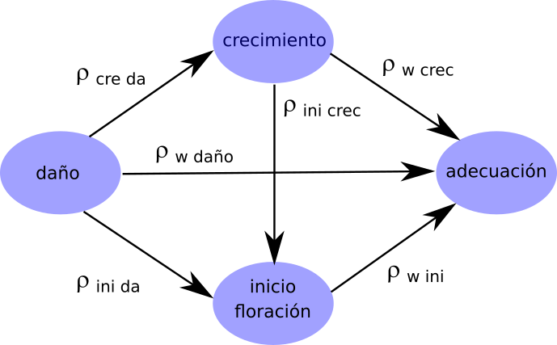
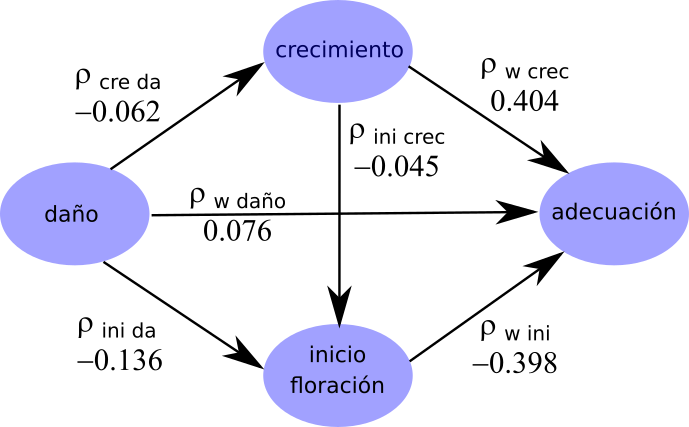
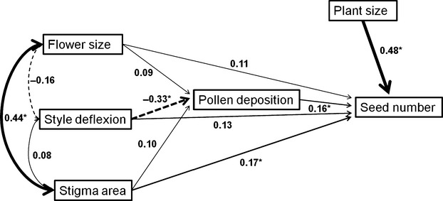

```{r setup, include=FALSE, warning=FALSE, message=FALSE, cache=TRUE}
knitr::opts_chunk$set(echo = TRUE)
library(lavaan)

```

#### Introducción
Utilizaremos los datos de Carmona (2006) sobre la evolución fenotípica de la resistencia de *Datura stramonium* contra su herbívoro folívoro *Epitrix sp.*, los cuales se encuentran contenidos en el archivo datura1.txt. Para realizar el análisis utilizaremos el paquete *lavaan* de R. Como pre-procesamiento de los datos, vamos a estandarizar todal las variables.   

```{r, message=FALSE}
library(lavaan)
datura <- read.table("datura1.txt", header = T)
datos <- data.frame(scale(datura))

```

#### Hipótesis causal  
Utilizaremos el siguiente modelo como hipótesis para explicar la relación entre el daño por herbívoros, el crecimiento, el tiempo hasta el inicio de la floración, y la producción de frutos (adecuación) en *Datura stramonium*. Cada flecha representa una relación causal: la variable de origen de la flecha es la supuesta causa, la variable que es señalada por la flecha es la variable de respuesta. Las flechas dobles se usan para indicar varianzas o covarianzas.   

  

#### Modelado de rutas mediante regresiones.   

Los coeficientes de ruta son simbolizados con la letra rho ($\rho$). Por ejemplo, en la relación daño → crecimiento, el coeficiente de ruta puede representarse como $\rho_{cre, da}$. Los coeficientes de ruta pueden estimarse a partir de una serie de regresiones múltiples, de donde los coeficientes parciales (i.e., la relación entre dos variables habiendo “controlado” el efecto de las demás) son los coeficientes de ruta.   

```{r}
# sólo daño afecta a crecimiento
m1<- lm(crec ~ dano, data = datos)
summary(m1)
```

```{r}
# daño y crecimiento afectan a floración
m2 <- lm(flor.dias ~ dano + crec, data = datos)
summary(m2)
```

```{r}
# finalmente daño, crecimiento y floración afectan a la adecuación
m3 <- lm(frutos ~ dano + crec + flor.dias, data = datos)
summary(m3)
```

Con estos datos podemos colocar todos *coeficientes de ruta*   

  

#### Coeficientes de efectos   

Los coeficientes de efectos sobre una variable dependiente son calculados para estimar el efecto total de una o varias causas. Típicamente son referidas con la letra **r**. Un coeficiente de efecto tiene 4 componentes: efectos causales (directos e indirectos) y efectos no causales (espurios y “no analizables”).   

* Efecto directo: es el coeficiente de ruta.   
* Efecto indirecto: es el producto de los coeficientes de ruta involucrados.   
* Efectos espurios: ocurren cuando hay una variable causal común para las variables sobre las que se calcula un componente de efecto indirecto.   

Cálculo para el modelo de *Datura* 
* Daño sobre crecimiento. Directo. -0.063   
* Daño sobre floración. Directo + Indirecto. -0.143 + (-0.063 × -0.045) = -0.140   
* Crecimiento sobre floración: Directo. -0.045   
* Crecimiento sobre adecuación. Directo + Indirecto. 0.377 + (-0.045 × -0.366) = 0.393   
* Floración sobre adecuación. Directo. -0.366.   
* Daño sobre adecuación. Directo + Indirecto. 0.073 + (0.377 × -0.063) + (-0.366 × -0.143) = 0.102. Tiene efectos espúreos: -0.366 × -0.045 × -0.063 = -0.001

Cálculo del componente no analizable    

$$U = \sqrt{1-R^2}$$ 
Por ejemplo, el efecto de variables desconocidas sobre la adecuación sería $U_{fru} = \sqrt{1
– 0.296} = 0.839$ 


#### Modelado de ecuaciones estructurales mediante *lavaan*. 

En base al conocimiento del sistema de relaciones causales, pueden proponerse varios modelos alternativos y evaluar cuál de ellos presenta mejor ajuste. En este caso construimos tres modelos para *Datura*.   

**MODELO 1**   

```{r, message=FALSE, cache=TRUE}
library()
# modelo saturado
sat <- '
frutos ~ crec + flor.dias + dano
flor.dias ~ crec + dano
crec ~ dano'
fit.sat <- sem(model = sat, data = datos, missing = "listwise",
fixed.x = F)
summary(fit.sat, standardized = T, rsq = T, fit.measures = T)
```

**MODELO 2**   
```{r}
# modelo con efectos indirectos del daño,
# y sin efecto del crecimiento en la floración
exdano <- '
frutos ~ crec + flor.dias
flor.dias ~ dano
crec ~ dano'
fit.exdano <- sem(model=exdano, data=datos, missing="listwise",
fixed.x=FALSE)
summary(fit.exdano, standardized = TRUE, rsq = T, fit.measures = T)
```

**MODELO 3**
```{r}
# modelo con efecto del crecimiento en la floración
# y sin efecto del daño en la floración
exdano2<-'
frutos ~ crec + flor.dias
flor.dias ~ crec
crec ~ dano'
fit.exdano2 <- sem(model=exdano2, data=datos, missing="listwise",
fixed.x=FALSE)
summary(fit.exdano2, standardized=TRUE, rsq=T, fit.measures=T)
```

**REPORTE**   

Construcción de una tabla de resultados
Es necesario reportar el $\chi^2$ del modelo y su significancia. Existe mucha divergencia sobre qué índice de ajuste del modelo reportar, pero es conveniente reportar al menos uno de ellos. Finalmente, pude ser importante reportar algún criterio de información para comparar entre modelos.   


Modelo | $\chi^2$ | df | P | SRMR | AIC 
----------|-------|-------|-------|-------|-------   
sat    | 0 | 0 | - | 0 | 2882.53
exdano | 2.503 | 2 | 0.286 | 0.028 | 2881.04
exdano2 | 7.345 | 2 | 0.025 | 0.060 | 2885.88


### Ejercicios

Utilizaremos los datos del trabajo de Dai & Galloway (2013) que puden descargarse libremente de [Dryad](https://datadryad.org/stash/dataset/doi:10.5061/dryad.s1q0h). Los autores midieron tres rasgos fenotípicos en plantas de *Passiflora incarnata*: tamaño de la flor, área del estigma y deflección del estilo. El éxito de apareamiento fue definido como el número de granos de polen deposuitados en el estigma. El éxito reproductivo femenino fue estimado como el número total de semillas producidas por la planta. Finalmente, también se midió el tamaño de las plantas como una medida que puede afectar el éxito reproductivo. La hipótesis principal de este estudio es que los rasgos florales afectan el aparemiento (selección sexual) y a su vez, este influye sobre el éxito reproductivo, como se detalla en este diagrama.   
   
    

1. Reconstruya este análisis de senderos utilizando el set de datos proporcionado.    
2. Idenifique las variables endógenas y exógenas, las vias que corresponden a efectos y las vías que corresponden a correlaciones.   
3. ¿Puede proponer otra hipótesis causal para estas variables? Ajústela y compare la adecuación de los dos modelos.


*Los datos de este ejercicio fueron obtenidos de:*  
Dai C & Galloway LF (2013) Sexual selection in a hermaphroditic plant through female reproductive success. *Journal of Evolutionary Biology* 26: 2622-2632.  
