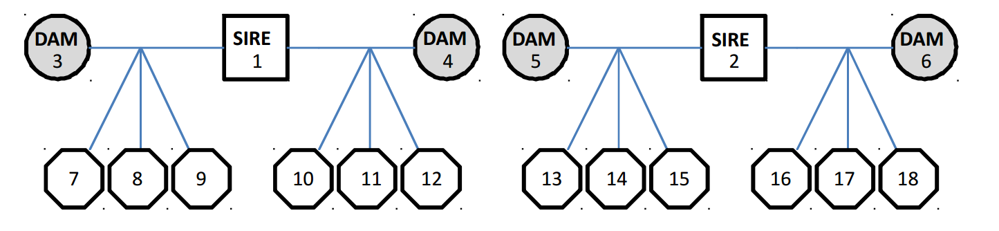

```{r setup, include=FALSE}
knitr::opts_chunk$set(echo = TRUE)
```

### Introducción  

Utilizaremos los datos de:   

* Fornoni J, Valverde PL, Núñez-Farfán J. 2003. Quantitative genetics of plant tolerance and resistance against natural enemies of two natural populations of *Datura stramonium*. Evolutionary Ecology Research 5: 1049–1065.   

Para mostrar el cálculo de la heredabilidad de la resistencia a la herbivoría en plantas de *Datura stramonium* provenientes de Ticumán, México (ver sector superior de la tabla 2 en el paper). Se utilizó un diseño de medios hermanos paternos (half-sibling design) donde cada planta donadora de polen (padres o Sires) se cruzó con dos receptoras (madres o Dams), para obtener varias plantas hijas.   

Si bien este es un diseño de cruzamientos, la información puede presentarse de la mima manera que un *pedigree*. Habitualmente Los *modelos animales* se utilizan para pedigrees mucho más complejos, obtenidos de poblaciones naturales o artificiales mediante el uso de marcadores moleculares. Al no requerir curzamientos para obtener la progenie, los pedigrees también son aplicables a poblaciones de organismos con tiempos de generación largos.    
En este práctico utilizaremos una aproximación Bayesiana mediante el paquete *MCMCglmm*. Para una descripción detallada del modelo ver:   

* Wilson AJ, Réale D, Clements MN, Morrissey MM, Postma E, Walling CA, Kruuk LEB, Nussey DH. 2010. An ecologist’s guide to the animal model. Journal of Animal Ecology 79: 13–26. http://www.wildanimalmodels.org/tiki-index.php   

### Ingreso y preparación de datos   

El diseño de cruzamientos en el trabajo de Fornoni *et al.* (2003) puedo resumirse en esta imagen, donde *sires* son las plantas dadoras de polen, *dams* son las receptoras y el resto son plantas hijas, formando familias de medios hermanos paternos. Notar que cada individuo (o "animal") recibe un número identificador único.   

 

```{r, eval=TRUE, cache=TRUE}
Data <- read.table("daturaHER2.txt", header=TRUE)
head(Data) #vistazo de los primeros valores
Data$animal <- as.factor(Data$animal)

```

El análisis requiere de un segundo archivo con el pedigree, este se construye sencillamente listando todos los individuos de nuestra población e indicando su número de animal (ID) su padre y su madre. Si estos últimos datos no son conocidos se indica con NA.   

```{r, eval=TRUE, cache=TRUE}
Ped <- read.table("daturaPED.txt", header=T)
head(Ped) # inspección de los primeros individuos

```

El pedigree debe ser reordenado para que los ancestros queden al principio y los descendientes al final. Esto es sencillo en este caso pero puede ser dificultoso en poblaciones naturales. Por eso utilizaremos la función *orderPed* del paquete *MasterBayes*. Además, es necesario indicar que los números de hijos, padres y madres son factores.

```{r, eval=TRUE, cache=TRUE, message=FALSE}
library(MasterBayes)
Ped<-orderPed(Ped)

Ped$ID<-as.factor(Ped$ID)
Ped$MOTHER<-as.factor(Ped$MOTHER)
Ped$FATHER<-as.factor(Ped$FATHER)

```

### Ajuste del modelo Bayesiano
Utilizaremos el paquete *MCMCglmm*. Antes de construir el modelo es necesario especificar el *prior*, es decir el conocimiento previo que tenemos sobre el sistema y cuanto confiamos en él. En este caso utilizaremos un prior no informativo ("flat") donde nuestra expectativa a priori es *V* y nuestra confianza (*nu*) en esa expectativa es muy baja. **R** refiere a la estructura de los residuos, **G** a la estructura de los efectos random y, en caso de existir, **B** referiría a la estructura de efectos fijos.   

```{r, eval = TRUE, cache=TRUE, message=FALSE}
library(MCMCglmm)
prior1 <- list(G = list(G1 = list(V = 1, nu = 0.002)), R =
list(V = 1,nu = 0.002))

```

Ajustamos el modelo en sí, que tiene una estructura similar a lme4. Por defecto el programa hará 10000 iteraciones en la cadena de Markov y utilizará 3000 extra de "encendido". Estas 10000 iteraciones son muestreadas una vez de 10 ("thinning interval"). Luego realizamos diagnósticos para saber si nuestro modelo es adecuado. Utilizremos la transformación solamente para comparar nuestros resultados con los reportados en Fornoni et al. (2003). Esta transformación *no es necesaria*.     

```{r, eval=TRUE, cache=TRUE, message=FALSE}
model1 <- MCMCglmm(arcsinR2 ~ 1, random = ~animal, pedigree =
Ped, data = Data, prior = prior1, verbose = FALSE)

# diagnósticos numéricos. Idealmente, las correlaciones
# para lag>0 deben ser lo más bajas posibles
autocorr(model1$VCV)

#diagnósticos gráficos
#examinar variación alrededor de la media e histograma
plot(model1$Sol)

# examinar variación alrededor de la media e histograma
# y que no haya tendencias o serpenteos.
plot(model1$VCV)

```

Vemos altos valores de autocorrelación para lags de 10, por lo que correremos un modelo nuevo, con mayor número de iteraciones y con muestreos en la cadena más espaciados. Utilizaremos un tiempo de encendido más largo para evitar tendencias al principio. Este modelo demorará varios minutos en la computadora.   

```{r, eval=TRUE, cache=TRUE, message=FALSE}
model2 <- MCMCglmm(arcsinR2 ~ 1, random = ~animal, pedigree = Ped,
data = Data, nitt = 130000, thin = 100, burnin = 30000, prior =
prior1, verbose = FALSE)

autocorr(model2$VCV)

```

Estimamos la varianza posterior y sus Highest Posterior Density Intervals. La varianza "animal" es la explicada por las relaciones de parentesco. La varianza de "units" corresponde a la residual.   

```{r, eval=TRUE, cache=TRUE, message=FALSE}
posterior.mode(model2$VCV)

HPDinterval(model2$VCV)

```

### Estimación de la heredabilidad   

Construiremos una cadena para la heredabilidad, lo que nos va a permitir obtener su estimación y su intervalo de credibilidad.   

```{r, eval=TRUE, cache=TRUE, message=FALSE}
# cadena
post.her<-model2$VCV[,"animal"] /(model2$VCV[,"animal"]+ model2$VCV
[,"units"])

# HEREDABILIDAD
posterior.mode(post.her) 

# examen gráfico
plot(post.her)
```

### Modelo con efecto materno   

Ajustaremos un modelo con efectos maternos. Para esto hay que modificar el prior ya que existe una nueva fuente de varianza (notar que hay dos G).   

```{r, eval=TRUE, cache=TRUE, message=FALSE}
# prior
prior3 <- list(G = list(G1 = list(V = 1, nu = 0.002), G2 = list(V =
1,nu = 0.002)), R = list(V = 1,nu = 0.002))  

# modelo
model3 <- MCMCglmm(arcsinR2 ~ 1, random = ~animal + Dam, pedigree =
Ped, data = Data, nitt = 130000, thin = 100, burnin = 30000, prior =
prior3, verbose = FALSE)  

# cadena
post.her3 <- model3$VCV[, "animal"]/
(model3$VCV[,"animal"] + model3$VCV[, "Dam"] + model3$VCV[, "units"])

# intervalo de credibilidad
HPDinterval(post.her3, 0.95)

# heredabilidad
posterior.mode(post.her3)

```

Utilizaremos el criterio de información de la devianza (DIC, un análogo a AIC para modelos Bayesianos), para comparar entre modelos y conocer si es importante incorporar efectos maternos. Aquel modelo con menor DIC será preferido.   

```{r}
model2$DIC # sin efectos maternos
model3$DIC # con efectos maternos
```

### Ejercicios
Analizaremos los datos suplementarios de Wilson *et al.* (2010). El archivo gryphonped.txt contiene el pedigree con tres columnas correspondientes a cada animal, su padre y su madre.  Este es un pedigree multigeneracional.   
Los datos fenotípicos y factores adicionales se encuentran en el archivo  gryphon.txt. Las columnas corresponden a la identidad individual (animal), la identidad de la madre (mother), el año de nacimiento (byear), sexo (sex, 1=female, 2=male), el peso al nacer (bwt), y la longitud del tarso (tarsus).   
Estimar la heredabilidad de la longitud del tarso. En un segundo modelo incorporar el sexo como *factor fijo* y omprobar si mejora el ajuste.   


