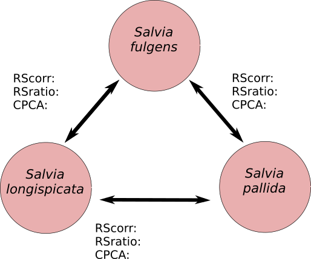

```{r setup, include=FALSE}
knitr::opts_chunk$set(echo = TRUE)
```

### Random (selection) skewers   

La ecuación de los criadores multivariada establece que $\Delta z = G\beta$ donde $\Delta z$ es la respuesta a la selección, $\beta$ es un vector que contiene los valores de los gradientes de selección sobre cada rasgo y **G** es la matriz de varianza-covarianza genotípica.   
   
Por lo tanto, aunque dos poblaciones se encontraran en un idéntico escenario selectivo (idénticos valores de $\beta$), su respuesta a la selección podría ser diferente si estas poblaciones difieren en sus matrices **G**. La forma y orientación de **G** puede acelerar o retrasar el cambio evolutivo.   
   
Invirtiendo el razonamiento, podemos estimar en qué grado se diferencian dos matrices comparando su respuesta a la selección. Como no siempre tendremos datos de la selección medida en la naturaleza (y de todos modos la selección puede variar espacial o temporalmente), la simularemos creando miles de vectores de selección, aplicándolos a ambas matrices **G** (*skewer* se traduce como "brocheta") y obteniendo respuestas a la selección. Si las respuetas son iguales, podemos inferir que las matrices **G** son iguales, si son diferentes las **G** estarán sesgando la respuesta a la selección de maneras diferentes. Para evaluar este sesgo examinaremos dos aspectos de la respuesta a la selección: su *magnitud* y su *dirección*.    
   
Para evaluar las diferencias en *magnitud* entre dos respuestas, examinaremos el cociente entre dos magnitudes (que debería ser 1 si fueran iguales). Para examinar las diferencias en *dirección* examinaremos el ángulo que forman los dos vectores de respuesta en el espacio multivariado. Existen dos maneras de reportar este ángulo: como valor angular (debería ser 0 en caso de repuestas idénticas), o como coseno del ángulo, medida que corresponde a la *correlación entre vectores* (y toma valor de 1 cuando las respuetas son idénticas). En este ejercicio utilizaremos la segunda medida.    
   
Para este ejercicio utilizaremos datos de seis rasgos florales de dos poblaciones de *Calceolaria polyrhiza* de la Provincia de Santa Cruz (Argentina). En este trabajo utilizaremos matrices fenotípicas (**P**) como aproximaciones a la matriz genotípica (**G**). El sitio de una de las poblaciones (Tapi Aike) estuvo cubierto por los hielos durante las glaciaciones pleistocénicas, mientras que la otra población (Las Horquetas) se ubica en un área de refugio. Estos datos fueron obtenidos de:   
   
Maubecin, C.C., Cosacov, A., Sérsic, A.N., Fornoni, J., & Benitez‐Vieyra, S. (2016). Drift effects on the multivariate floral phenotype of *Calceolaria polyrhiza* during a post‐glacial expansion in Patagonia. *Journal of Evolutionary Biology* **29**, 1523-1534.
   
Las rutinas para este ejercicio se obtuvieron del material suplementario de este trabajo (con ligeras modificaciones), disponible en:  https://github.com/santiagombv/random.skewers    
   
#### Ingreso de datos y construcción de matrices fenotípicas (**P**)   

```{r}
tapi<-read.table("TAPI.txt", header = TRUE)
horq<-read.table("HORQ.txt", header = TRUE)

Gtapi <- cov(tapi, use = "complete.obs")
Ghorq <- cov(horq, use = "complete.obs")

```


#### La función *random.skewers*  

```{r}
# Argumentos
# G1 y G2 son matrices de varianza-covarianza.
# rep es el número de random skewers a aplicar.

# Output.
# La salida es un data.frame de dos columnas. La columna ratio es el 
# cociente entre la longitud de los vectores respuesta correspondientes 
# a G1 y G2. La columna correlation contiene medidas de la co-linealidad
# de los vecores respuest en el espacio morfométrico multivariado, que 
# equivale al coseno del ángulo entre los vectores respuesta.

random.skewers<-function(G1, G2, rep){
  N1 <- ncol(G1)
  N2 <- ncol(G2)
  if(N1 != N2) stop("G1 and G2 have different dimensions") else N <- N1
  rd.sk <- function(G1, G2){
    RS1 <- runif(n=N)		
    sign <- c(-1,1)
    RS2 <- vector(length=N)
    for (i in 1:N) RS2[i] <- sample(sign, size=1)*RS1[i]
    RS3 <- RS2/as.vector(sqrt((t(RS2)%*%RS2)))
    dz1 <- G1%*%RS3
    dz2 <- G2%*%RS3
    res <- c(sum(dz1^2)/sum(dz2^2), 
             (t(dz1)%*%dz2)/sqrt((t(dz1)%*%dz1)*(t(dz2)%*%dz2)))
    return(res)
  }
  RES <- data.frame(t(replicate(rep, rd.sk(G1=G1, G2=G2))))
  colnames(RES) <- c("ratio", "correlation")
  return(RES)
}
```

#### La función *sim.vec.cor*
```{r}
# Argumentos.
# k es el número de rasgos en el análisis de random skewers.
# rep es el número de pares de vectores simulados.

# Output.
# Un vector de longitud igual a rep conteniendo la correlación entre los
# vectores creados al azar. 

sim.vec.cor <- function(k, rep){
  vec.cor <- function(k){
     RS1 <- runif(n=k)*sample(c(-1,1), size = k, replace = TRUE)
     RS1 <- RS1/as.vector(sqrt((t(RS1)%*%RS1))) 
     RS2 <- runif(n=k)*sample(c(-1,1), size = k, replace = TRUE)
     RS2 <- RS2/as.vector(sqrt((t(RS2)%*%RS2)))
     ang <- acos(t(RS1)%*%RS2/as.vector(sqrt((t(RS1)%*%RS1)*(t(RS2)%*%RS2))))
     res <- ifelse(ang > pi/2, cos(pi-ang), cos(ang))
     return(res)
  }
  replicate(rep, vec.cor(k))
}

```

#### Ejecutando el análisis

```{r}
# Crear los random skewers.
RS <- random.skewers(G1 = Gtapi, G2 = Ghorq, rep = 1000)

# Obtener la respuesta media para la proporción entre la 
# longitud de los vectores de respuesta
mean(RS$ratio)

# Obtener la correlación media entre los vectores de respuesta
mean(RS$correlation)

# Estimar el percentil 95% de la correlación esperada
# entre vectores aleatorios
SC <- sim.vec.cor(k = 6, rep = 1000)
quantile(SC, probs = 0.95)
```

### Análisis de Componentes Principales Comunes   
   
El propósito de este análisis es comparar dos matrices poniendo a prueba una serie de hipótesis jerárquicas, a través del examen de sus *eigenvalores* y *eigenvectores*. Volviendo a una analogía de la matriz **G** con una pelota (digamos de rugby) los *eigenvectores* describirían su posición en el espacio (y por tanto sirven para caracterizar el ángulo entre dos matrices) y los *eigenvalores* describirían el largo de sus ejes mayor y menor (describiendo cómo se reparte la variabilidad).   

Dos matrices pueden ser:  

* **Iguales**: si comparten *eigenvalores* e *eigenvectores*.   
* **Proporcionales**: si comparten *eigenvectores*, pero los *eigenvalores* de una son iguales a los de la otra multiplicados por una constante (las pelotas de rugby son idénticas, salvo que una es más grande que la otra en todos los sentidos).   
* Con **componentes principales comunes**: comparten todos los *eigenvectores*, pero sus *eigenvalores* difieren.   
* Con **X componentes principales comunes**: comparten X *eigenvectores*.   
* **Desiguales**.   
   
Para este análisis utilizaremos el software de Patrick Phillips CPC, disponible en http://pages.uoregon.edu/pphil/software.html (DOS para Windows). Instalar el archivo ejecutable en la misma carpeta donde se encuentren los sets de datos.     

#### Ingreso de datos    
   
Una vez instalado el programa ingresaremos los datos en un archivo horq_tapi.dat con el siguiente formato.   

* Primer renglón: nombre de las matrices separadas por espacios.   
* Segundo renglón: nombre de las variables, separadas por espacios.   
* Tercer renglón: número de observaciones en la población 1.   
* 6 renglones subsiguientes (en este caso): matriz de covarianza de la población 1   
* Número de observaciones en la población 2   
* 6 renglones subsiguientes (en este caso): matriz de covarianza de la población 2   
* Último renglón: en blanco.   
   
Este archivo debe guardarse en la misma carpeta donde se encuentra el programa    

#### Análisis   
   
Ejecutar el archivo cpc. En la pantalla negra (si, es tan viejo que ¡corre en DOS!) indicar:      

```
Data file name: horq_tapi.dat
Output file name: inventar uno, en este caso horq_tapi.out
Are matrix and trait names included in the file (n)?: Y
Manually reorder column names for PCPC analysis (n)?: N
Limit the number of PCPC analysis (n)?: N
```
   
Si todo está bien el programa comenzará a enunciar las hipótesis, acabando con done! Presionar Enter para finalizar. En algunos casos suele ser mejor poner la ruta completa a los archivos.   

#### Interpretación de los resultados.   
   
La cantidad de tests estadísticos puede parecer apabullante en el archivo de salida. Realizaremos la selección del modelo óptimo mediante AIC y una prueba secuencial de hipótesis. Para eso vamos al final del archivo y buscamos la siguiente tabla:   

```
*** Flury Decomposition of Chi Square ***
(Step-up & model building approaches)
_______Model______
Higher      Lower     Chi Sqr   df    p-val     CS/df   AIC
--------------------------------------------------------------
Equality    Proport   0.646     1     0.4216    0.646   39.448
Proport     CPC       20.286    5     0.0011    4.057   40.802
CPC         CPC(4)    1.336     1     0.2477    1.336   30.516
CPC(4)      CPC(3)    0.523     2     0.7697    0.262   31.180
CPC(3)      CPC(2)    4.922     3     0.1776    1.641   34.657
CPC(2)      CPC(1)    2.314     4     0.6783    0.578   35.734
CPC(1)      Unrelated 9.421     5     0.0934    1.884   41.421
Unrelated   ---                                         42.000

```

Buscamos en el archivo la descripción del modelo elegido (CPC)   

```
*** Test for Common Principal Components Among the Matrices ***
Criterion for CPC: -1417.80385
Number of parameters (CPC): 27
```

Dentro de esta sección hay mucha información:   
*Likelihood ratio test chi-square for H0-CPC versus ...*: Realiza una prueba de hipótesis entre CPC (tomada como H0) y cada una de las otras hipótesis.    
*Eigenvalues for CPC Matrices*: Los eigenvalores indican la cantidad de variabilidad en una dirección. Podemos ver que Tapi Aike tiene casi el doble de variabilidad en el primer componente principal que Las Horquetas, mientras que en el segundo son similares.   
*Maximum likelihood estimate of...*: Son las matrices estimadas según este modelo.   

**Considerando que Tapi Aike tiene un origen más reciente que Las Horquetas, ya que debe
haber sido colonizada hace 10000 años o menos, ¿cómo explicaría el patrón observado?**   

### Ejercicios:   

Se proveen de sets de datos de seis rasgos florales de las especies *Salvia fulgens*, *Salvia longispicata* y *Salvia pallida*. Entre cada **par de especies** realizar un análisis de Random Skewers y de CPCA de manera de comletar el siguiente esquema.    



Estas especies son polinizadas por picaflores (*S. fulgens*) o por abejas (*S. pallida* y *S. longispicata*). ¿Cómo interpretaría estos resultados?   
   
Estos datos fueron obtenidos de:   
Benitez‐Vieyra, S., Pérez‐Alquicira, J., Sazatornil, F. D., Domínguez, C. A., Boege, K., Pérez‐Ishiwara, R., & Fornoni, J. (2019). Evolutionary transition between bee pollination and hummingbird pollination in *Salvia*: Comparing means, variances and covariances of corolla traits. *Journal of Evolutionary Biology*, 32, 783-793.


